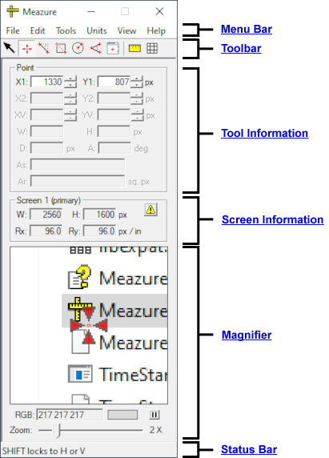

# MeazureTM

Meazure is a tool for easily measuring and capturing portions of the screen. Tasks such as measuring the size of a window,
capturing an image, determining the color of a pixel, and determining the screen size and resolution can all be
easily accomplished using Meazure.

## Minimum System Requirements

- Windows 10 Version 1607
- 64-bit system

## Downloading and Installation

The Windows installer for Meazure can be [downloaded from GitHub](https://github.com/cthing/meazure/releases).
In addition to installing the program files, the installer configures the system to run the Meazure program.
This configuration includes:

- Associating the file suffix `.mea` with the Meazure program
- Optionally placing an icon on the desktop

## User Guide

The Meazure User Guide is [available online](https://github.com/cthing/meazure/wiki) and is bundled with the
Meazure program as the help contents.

## License

Refer to the [LICENSE](LICENSE) file distributed with this program
for details on the licensing of the Meazure program.

## Building

Refer to [Building.md](Building.md) for information on how to build Meazure from source.

## Known Issues

- To open a position log file saved by Meazure 3.0 using Meazure 2.0, edit the position log file and change the DOCTYPE
  URL on line 2 from `https:` to `http:`. Position log files saved by Meazure 2.0 can be opened by Meazure 3.0 without
  modification.

- Meazure now accommodates high DPI displays (e.g. 4K) and the DPI scaling often used with them. However, you must
  restart Meazure if you change the DPI scaling while it is running.
  
## Feedback

Please [open an issue on GitHub](https://github.com/cthing/meazure/issues) for feature requests and to report bugs.

## Financial Contributions

We hope Meazure is a valuable addition to your software toolbox. Please consider
making a [financial contribution](https://github.com/sponsors/baron1405). Thank you!

## Changelog

### Changes 3.0.2 to 4.0

- Meazure now reports the Windows default screen resoltuion (96 DPI) as the default uncalibrated resolution. In
  previous releases, Meazure would query the operating system at runtime for the logical resolution. Typically,
  the returned value was 96 DPI. This change was made to properly report the resolution in the case of screen
  scaling.

- Enhancement: A more readable font is used for all dialogs

- Enhancement: A menu item is provided to switch the angle display to show the supplemental angle instead of the
  included angle. The sum of the included angle and the supplemental angle is 180 degrees.

- Color display enhancements and fixes
    - Enhancement: New color spaces that match the actual color to the
      [web basic and extended colors](https://www.w3.org/wiki/CSS/Properties/color/keywords).
    - Enhancement: A button is now provided to copy the contents of the color field to the clipboard. The button
      is located to the right of the color swatch.
    - Enhancement: The CMYK color space is device dependent. Therefore, any conversion between the native RGB color
      space and CMYK is an approximation without a color profile for the target device. This version of Meazure uses
      a more conventional formula for approximating CMYK from RGB than was used in previous versions.
    - Enhancement: The HSL color display has changed. In previous versions of Meazure, the HSL values were normalized
      between 0 and 240, which is unconventional and potentially confusing. In this release, the HSL values are
      displayed conventionally with the hue value in degrees in the range [0, 360), and the saturation and lightness
      values as percentages in the range [0, 100].
    - Fix: The YIQ color display now shows negative in-phase and quadrature values.
    - Leading zeros in all formats except hexadecimal have been removed. For example, the RGB value previously
      displayed as "010 020 255" is now displayed as "10 20 255".

- Fix: Meazure now reports the correct screen dimensions and measurements on high DPI displays (e.g. 4K display).
  
- Fix: Meazure accommodates screen scaling. Note that you must restart Meazure if you change the screen scaling
  (e.g. going from 100% to 150% scaling). To accommodate this, Meazure now reports the Windows default screen
  resoltuion (96 DPI) as the default uncalibrated resolution. In previous releases, Meazure would query the operating
  system at runtime for the logical resolution. However, that value is now the effective (i.e. scaled)
  resolution, which is not appropriate for calculating measurements in resolution-dependent units (e.g. inches).

- Fix: The Position log save dialog once again displays a text fields for specifying a title and description for
  the log file.

- Fix: Position log DTD defined the type for the desktop identifier and its references as ID and IDREF respectively.
  This was incorrect because the identifier is a GUID, which can start with a number and that is not allowed for an
  ID. The type has been changed to NMTOKEN, which allows a leading digit. Because the type is a superset of ID and
  to support backward compatibility, the name and version of the DTD has not been changed.

- Internal improvements
    - Migrated codesbase to C++17
    - Reorganized source code into subfolders
    - Extensive refactoring, renaming, and reorganizing of class functionality for testability and clarity
    - Increased unit test coverage
    - Use precompiled headers to greatly reduce build time
    - Use namespaces for static utility classes
    - Use the [Conan C/C++ Package Manager](https://conan.io/) for library dependencies (e.g. Boost)
    - Migrated to [Xerces C++ XML parser and validator](https://xerces.apache.org/xerces-c/) from expat and
      homegrown validator
    - Use an XML writer class for writing the profile and position log files. This centralizes all formatting
      and escaping of the XML.
 
### Changes 3.0.1 to 3.0.2

- Fix: Should not be able to paste numbers into readonly data fields.

- Fix: Unable to cut, copy, paste in description field on position log dialog.

- Fix: Typos in help content.

### Changes 3.0 to 3.0.1

- Fix: Not able to load position log files created by 2.0.

### Changes 2.0.1 to 3.0

- Supported on Windows 10 and above.

- Requires a 64-bit system.

- The minimum screen grid spacing has been reduced from 40 to 10 pixels and the maximum spacing
  has been increased from 1000 to 4000 pixels.

- Feature: The aspect ratio (i.e. width / height) is now displayed for the Rectangle, Window,
  and Line tools. For the Line tool, the aspect ratio is based on the bounding rectangle.

- Feature: The keyboard can now be used to position crosshairs. Pressing the Ctrl+1, Ctrl+2 and/or Ctrl+3
  plus one of the arrow keys will move the corresponding tool crosshair one pixel. For example, pressing
  Ctrl+1 and the Up arrow key will move the Point 1 crosshair up one pixel.

- Feature: Hotkeys can now be used to position crosshairs to the current location of the mousr pointer.
  Pressing the Ctrl+Shift+1, Ctrl+Shift+2, or Ctrl+Shift+3 moves the corresponding tool crosshair to the
  current location of the mouse pointer. For example, if the Line tool is being used, pressing
  Ctrl+Shift+2 will move the line's Point 2 crosshair to the current mouse location.

### Changes 2.0 to 2.0.1

- Publish Meazure as an Open Source project on GitHub under
  the GNU General Public License.

- Windows 98, ME, NT and 2000 are no longer supported.

### Changes 1.0 to 2.0

- Feature: A log of tool positions can be recorded and
  saved. The position log can be reloaded and played
  back. The position log file is in XML and the DTD
  is distributed with the program and is also available
  from the C Thing Software website.

- Feature: An Angle tool has been added. Using this tool,
  arbitrarily oriented angles can be measured.

- Feature: A Circle tool has been added. Using this tool,
  a circular area can be measured.

- Feature: The user can define their own set of units.

- Feature: Multiple monitor desktop configurations
  are now fully supported.

- Feature: The rulers can now be dragged across the
  screen.

- Feature: On Windows 2000 and above, the opacity can
  be set on the rulers, crosshairs and data windows.

- Feature: The origin of the coordinate system is now
  indicated by a marker.

- Feature: Additional color spaces are available for
  expressing the color value of a pixel. In addition,
  a text field is used to display the color so that
  the color value can be copied to the clipboard.

- Feature: Angles can now be reported in degrees or
  radians.

- Feature: The number of decimal places displayed for
  each measurement in each system of units can now be
  specified as a preference.

- Feature: Tool crosshairs can now be toggled between
  visible and hidden to aid in measuring small objects.

- Feature: There are now menu items for zooming the
  magnifier in and out.

- Feature: Resolution calibration can now be done in
  metric as well as english units.

- Feature: A master reset is now provided to restore
  the factory default settings.

- Feature: Windows XP display themes are now supported.

- Fix: A red rectangle no longer remains when changing
  to another tool from the Window Tool using the Tools
  menu.

- Fix: Certain screen appearance schemes (e.g. Eggplant)
  would cause the menu to wrap to two lines thereby
  partially obscuring the magnifier zoom slider. This
  has been corrected.

- Fix: When copying a screen region the tool outline and
  crosshairs were sometimes captured with the image. This
  has been corrected.

- Windows 95 is no longer supported.
